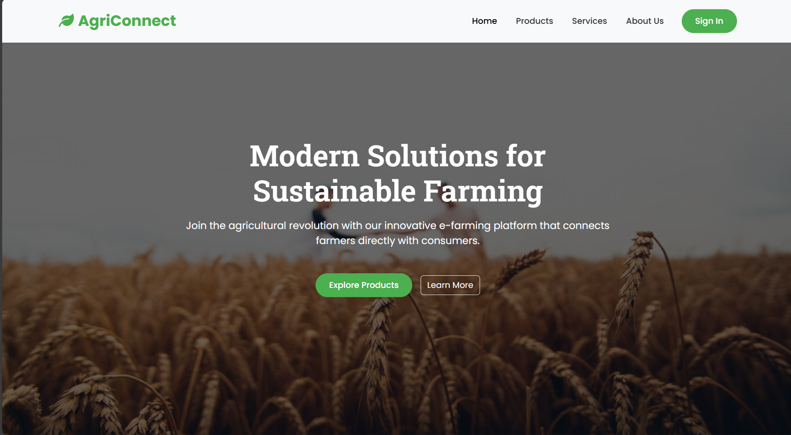

# AgriConnect: A MERN Stack E-Farming Marketplace 🚜

AgriConnect is a comprehensive web application built with the MERN stack (MongoDB, Express.js, React.js, Node.js) designed to modernize the farm-to-consumer supply chain. It provides a digital marketplace where local farmers can showcase their products, and consumers can browse and discover fresh, local produce.

The project was built from the ground up, starting from a design document and evolving into a feature-complete application with secure authentication, role-based access control, a full suite of management tools for both farmers and admins, and a professional, responsive user interface.



---

## ✨ Features

The application is structured around three distinct user experiences: the public visitor, the registered farmer, and the platform administrator.

### 👨‍🌾 For Farmers (Registered Users)
* **Secure Authentication:** Full registration and login system with encrypted passwords and JWT-based session management.
* **Profile Management:** A dedicated "My Profile" page where farmers can update their name, contact details, location, and upload a personal profile picture.
* **Farmer Dashboard:** A private, professionally designed dashboard serving as the central hub for all farmer activities.
* **Full Product Management (CRUD):**
    * **Create:** Add new products with names, descriptions, categories, quantities, and images.
    * **Read:** View a real-time list of all their own products.
    * **Update:** Edit the details of existing products via an interactive pop-up modal.
    * **Delete:** Remove products with a theme-matched, professional confirmation alert.
* **Advanced Communication System:**
    * **Low-Stock Alerts:** Receive private, one-to-one notifications from the admin when product stock is low, visible on a dedicated "My Notifications" page and indicated by a real-time badge on the navbar.
    * **Broadcast Management:** A unified "Admin Requests" page to view public requests from the admin, reply to new requests, and see the "Viewed by Admin" status of past replies.

### 👑 For Administrators (Admin Role)
* **Secure Admin Dashboard:** A private dashboard accessible only to users with the "admin" role.
* **Platform Overview:** At-a-glance statistics for total farmers, total products, and low-stock items.
* **Full Inventory & User Management:** View detailed tables of all products from all farmers and a complete list of all registered farmers.
* **Advanced Communication Tools:**
    * **Send Low-Stock Alerts:** Directly send a private notification to any farmer whose product is low on stock.
    * **Broadcast System:** Send public request messages to all registered farmers simultaneously.
    * **Reply Management:** View a dedicated page listing all farmer replies for a specific broadcast, mark replies as "viewed," and clear old replies.

### 🧍‍♂️ For Public Visitors
* **Dynamic Homepage:** A professionally designed landing page that introduces the platform and showcases featured products fetched from the database.
* **Marketplace Page:** A central page to browse the entire catalog of products.
* **Dynamic Search:** A real-time search bar to filter products by name or description.
* **Category Filtering:** A dropdown menu to filter products by category.
* **Product Detail Page:** A dedicated, professionally designed page for each product with a large image, full description, and details about the farmer.
* **Informational Pages:** Static pages such as "About Us" and "Services" that detail the mission and features of the platform.

---

## 🛠️ Tech Stack

* **Backend Runtime:** Node.js
* **Framework:** Express.js
* **Database:** MongoDB with Mongoose
* **Authentication:** JSON Web Tokens (JWT), bcrypt.js
* **File Uploads:** Multer
* **Frontend Library:** React.js (with Vite)
* **Routing:** React Router v6
* **HTTP Client:** Axios
* **Styling:** Bootstrap 5
* **Notifications:** React Toastify

---

## 🚀 Getting Started

To get a local copy up and running, follow these simple steps.

### Prerequisites
* Node.js and npm installed on your machine.
* MongoDB installed and running locally, or a connection string from MongoDB Atlas.

### Installation & Setup

1.  **Clone the repository:**
    ```bash
    git clone [https://github.com/lykanranger/AgriConnect-MERN.git](https://github.com/lykanranger/AgriConnect-MERN.git)
    cd AgriConnect-MERN
    ```

2.  **Setup the Backend:**
    * Navigate to the backend folder:
        ```bash
        cd backend
        ```
    * Install the dependencies:
        ```bash
        npm install
        ```
    * Create a `.env` file in the `backend` root and add your MongoDB connection string and JWT secret:
        ```
        MONGO_URI=your_mongodb_connection_string
        JWT_SECRET=thisisasecretkeyforagriconnectproject
        ```

3.  **Setup the Frontend:**
    * Open a new terminal and navigate to the frontend folder from the root directory:
        ```bash
        cd frontend
        ```
    * Install the dependencies:
        ```bash
        npm install
        ```

---

## 🏃 Running the Application

You will need two terminals running simultaneously to start the application.

1.  **Start the Backend Server:**
    ```bash
    # From the /backend directory
    npm start
    ```
    The server will start on `http://localhost:5000`.

2.  **Start the Frontend Development Server:**
    ```bash
    # From the /frontend directory
    npm run dev
    ```
    The React application will open in your browser, usually at `http://localhost:5173`.
